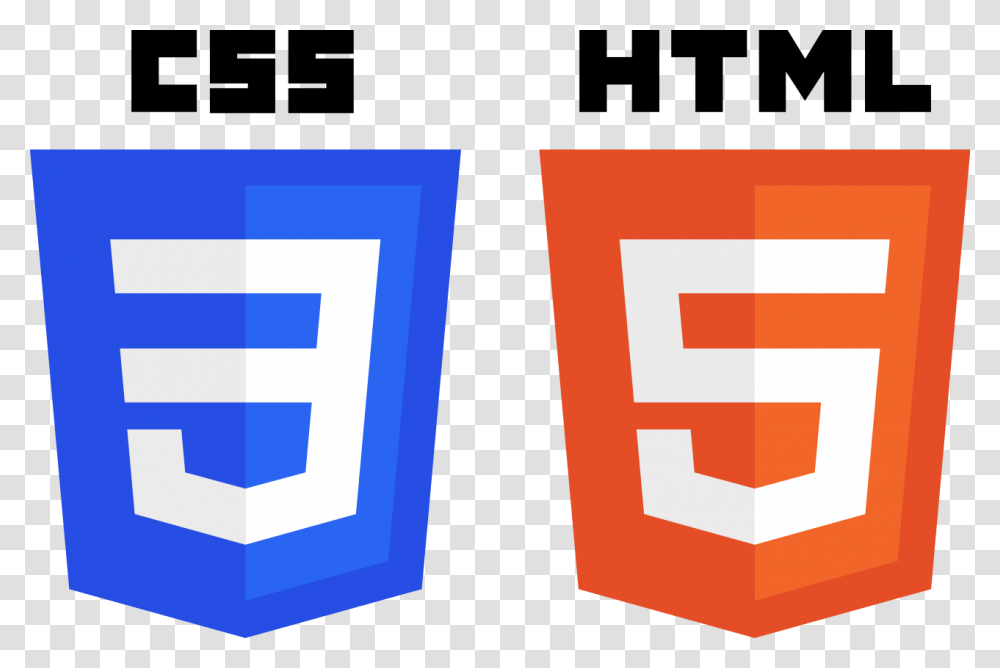

# Armen Deroian (Cosmic5173)
Hello there! My name is Armen Deroian (He/Him), I am a young developer who is learning everything he can about Computer Science. (My 'online' name is Cosmic5173) I plan to major in this field in college. As of now, I enjoy teaching myself using various online resources, and working with my friends who also are learning. The 2 major areas that I am working with are game development ([Unity](https://unity.com/)) and backend development.

Looking into the future, I plan to go to college, continue learning as much as I can about this field, and get a good job in it. I also plan to teach myself web development front-and and back-end, work on Rest APIs, and networking / system management (Linux, docker, etc.).

***

## Links

[Discord](https://discord.com/users/870867340579995678) \
[Community Server](https://discord.cosmic5173.com) \
[Website](https://www.cosmic5173.com) \
[Email](mailto:contact@cosmic5173.com) \
[YouTube](https://www.youtube.com/channel/UCo0_SuIilrU9yCkxXfvyx2A) \
[Twitch](https://www.twitch.tv/cosmic5173)

***
 
## Current Projects
 
### Gildenkrieg
Gildenkrieg is a new 3D Warfare Game created by myself for Nightraid Studios. It is a huge project, aiming to create a cross platform game for all to enjoy. The main premise is for players to team up, create factions/empires, and declare war on other factions.
 
[Gildenkrieg](https://gildenkrieg.xyz) \
[Discord](https://discord.gildenkrieg.xyz)

### Warped Network
As of mid 2022, Warped Network has been revived from its former glory in 2019-2020. I have decided to work on a new Minecraft server with a few of my good friends. We plan for this server to be a cluster of fun gamemodes for people to enjoy.

### PM Gadgets
PM Gadgets is a small project of mine where in my free time, I create useful plugins libraries for PocketMine-MP. [PocketMine-MP](https://pmmp.io) is a very popular server software for ``Minecraft: Bedrock Edition``. You can go check out our [GitHub](https://github.com/PM-Gadgets) to see what projects may be useful to you.

### CosmicBot
Cosmic Bot is a Discord bot written in Java, using [JDA](https://github.com/DV8FromTheWorld/JDA). It is the biggest Discord bot I have ever worked on, and will be a base for some of my future, more public bots. The purpose for this bot is for practice and my community server.

[GitHub Project](https://github.com/Cosmic5173/CosmicBot)
 
***
 
## Past Projects
 
### Imperial Network
Imperial Network was my first-ever attempt at a Minecraft Network. It was founded and owned by my good friend [Zofu](https://www.youtube.com/channel/UCv1qaKC1bYd3A3O9r4KIB_g), and myself. This was my first time actually creating a public programming project that people could actually use. It got me to learn [PHP](https://php.net) and [PocketMine-MP](https://pmmp.io).
 
### Warped Network / Wyvern Factions (2019-2020)
Warped Network, also known as Wyvern Factions was my second, and long term Minecraft Network. This was my most (kinda) successful Minecraft Network. It was founded and owned by [EPT](https://github.com/EPT8TPE), Atlantis, and myself.
 
### TX Servers
TX Servers was probably the most meaningful Minecraft project I worked on. This was arguably the most wholesome, welcoming, friendly, and respectful community I was ever part of on Minecraft. I joined this server around June 2020, and was part of it till its end-of-life in November 2020. This project was founded by NightmareDG and owned by NightmareDG, PoisonouseSquash, Sassy, and CouchPez.
 
### Legend Network
Legend Network was the last Minecraft Network that I worked on (or so I thought), and plan to work on. It was founded by ItzFighters, and owned by Optical, Magix, and myself.

### Nightraid Studios
Nightraid Studios is a software company dedicated to creating new and innovative software for the world. It consists of many different areas of the field including Game Development, Restful APIs, Discord Bots, and more. Nightraid Studios was founded back in 2021 by Jamie Duddleston.
 
***
 
## Stats
### Known Languages and Frameworks

 
***

 

***

## Activity

